# README

> 2022-2023 秋季学期，中国科学技术大学《精密仪器设计》课程作业

## 建模作业

根据SR Joint的规格说明对零部件进行建模：

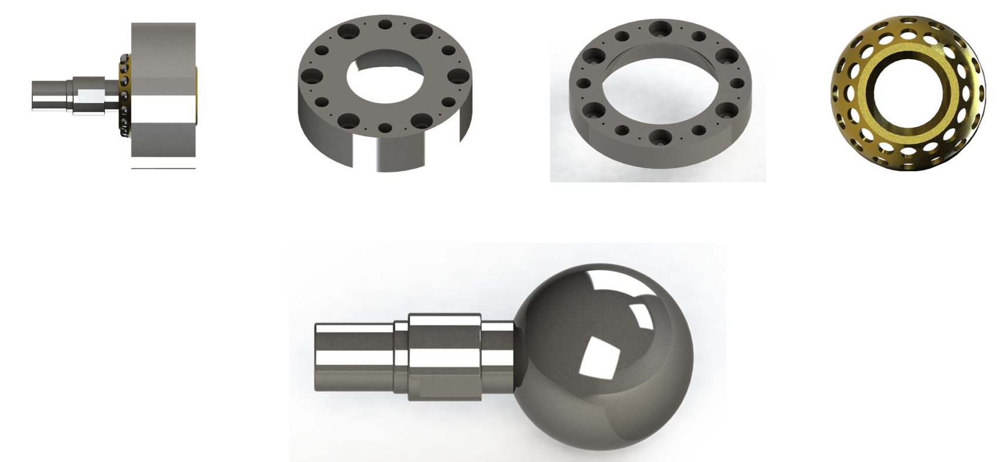

将零部件进行装配：

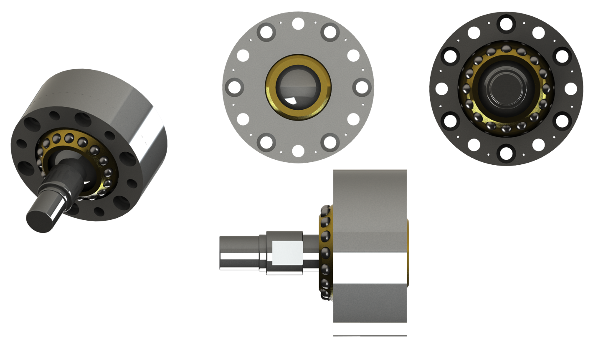

绘制装配图：

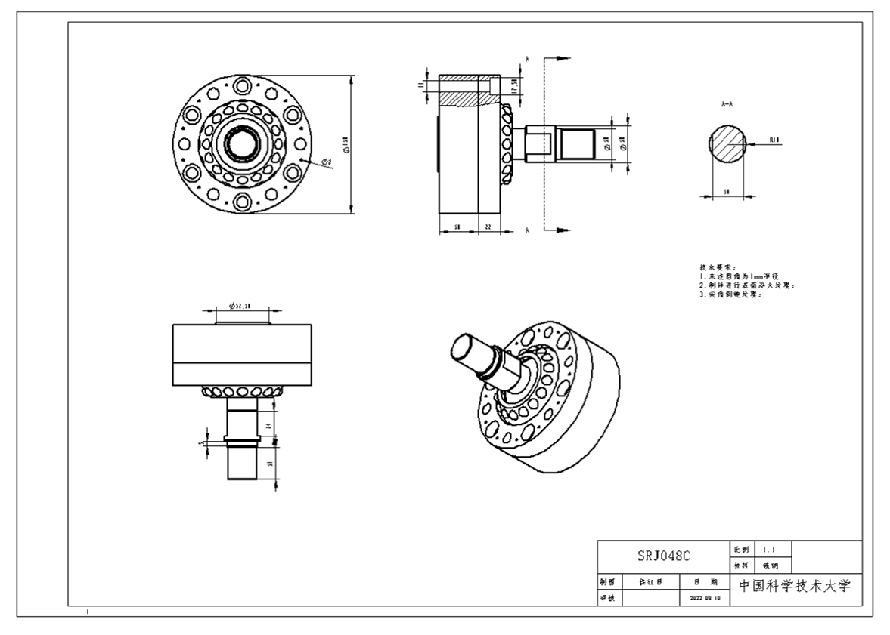

## 课程设计作业

### 调研

调研现有的机器狗的设计，拆解任务目标和具体步骤：

1. 拆解分析现有的机器狗结构组成； 
2. 设计合理的结构尺寸和排布方式；
3. 实现机器狗的各部件三维模型制作；
4. 实现各部件的装配组合； 
5. 实现运动学分析，进行运动学建模； 
6. 科学计算分析运动方程，进行调研和结构优化；
7. 完成报告，记录设计实现过程。

### 三维建模设计

关于三维模型的介绍以及电机、传感器和执行器的选型，设计具体尺寸，绘制零件图和装配图。

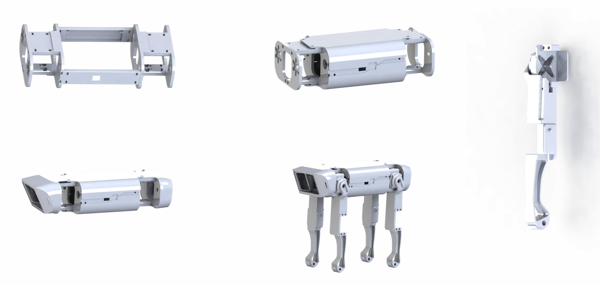

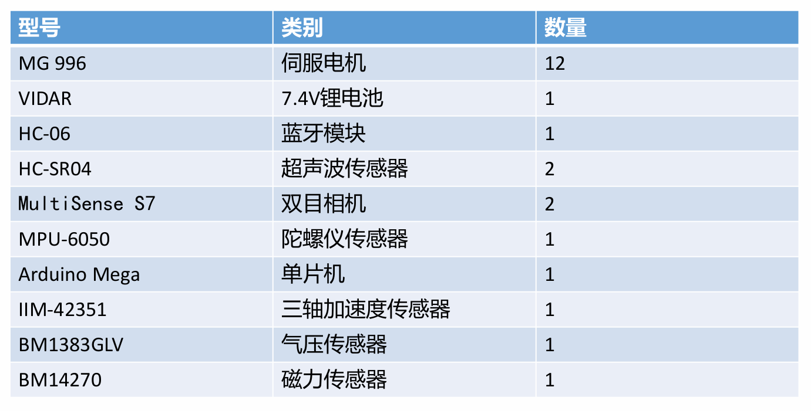

### 有限元分析

在solidworks里进行有限元分析，分为以下几步：

1. 建立算例，进行静力学分析；
2. 选择材料后应用；
3. 增加夹具，添加约束；
4. 根据情况施加载荷；
5. 选定密度，划分网格；
6. 运行算例分析结果；

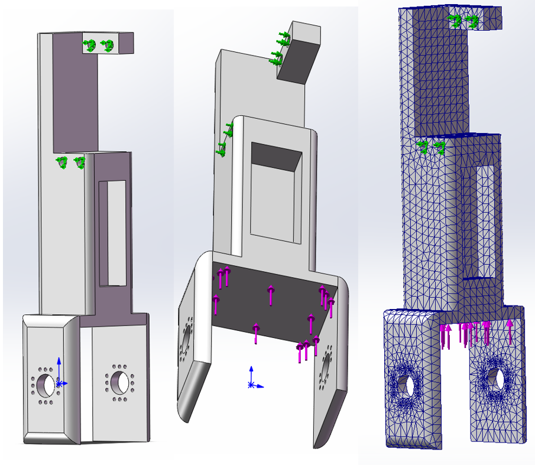

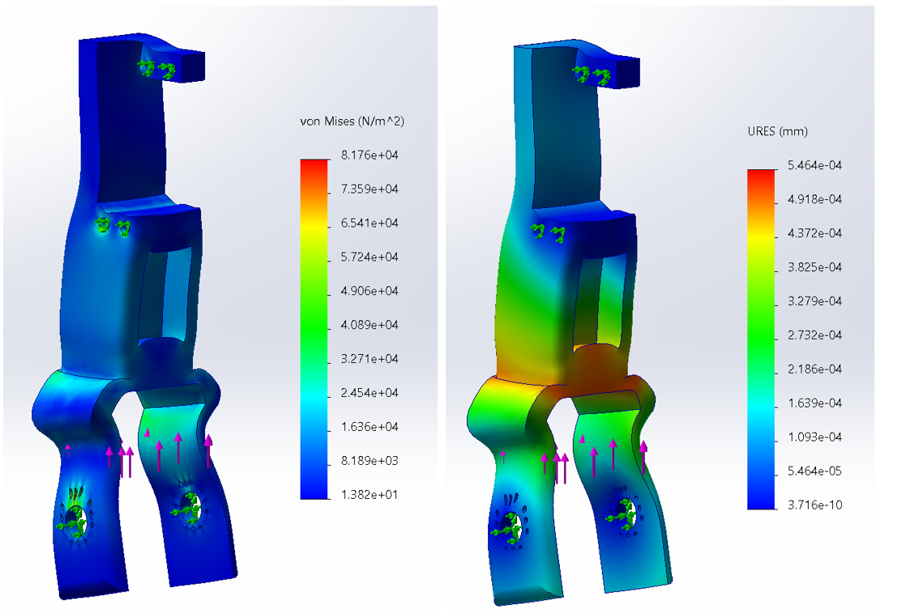

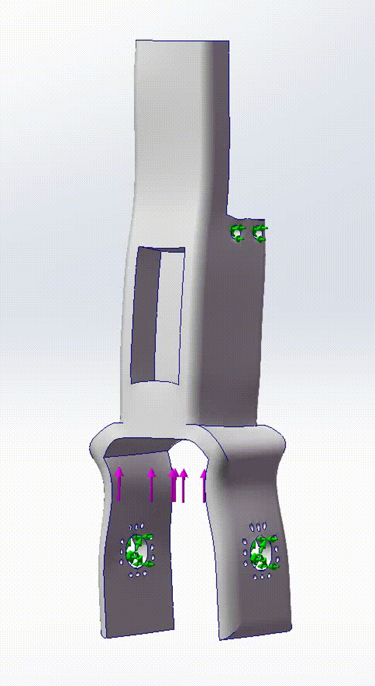

### 正运动学分析

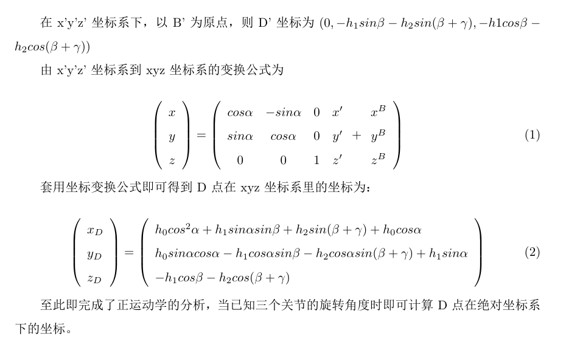

### 逆运动学

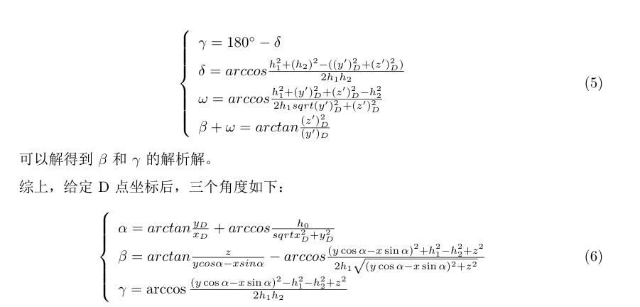

### 运动建模

通过Matlab/Simulink进行简单的运动建模，并进行Matlab模拟。

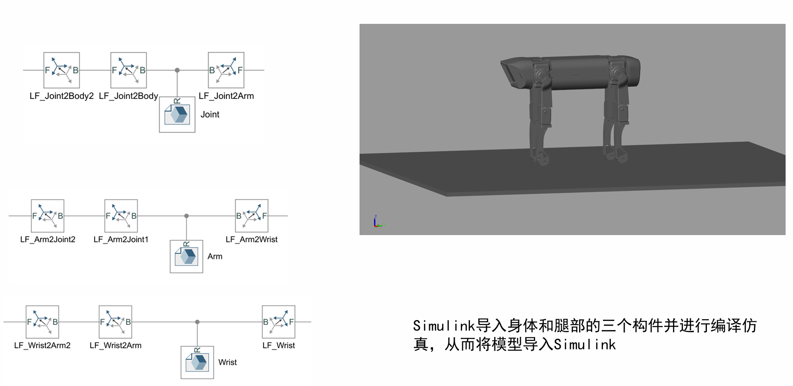

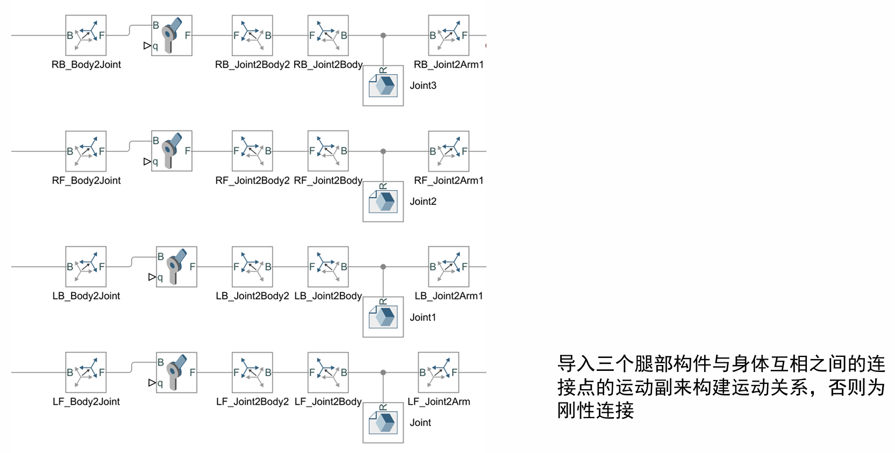

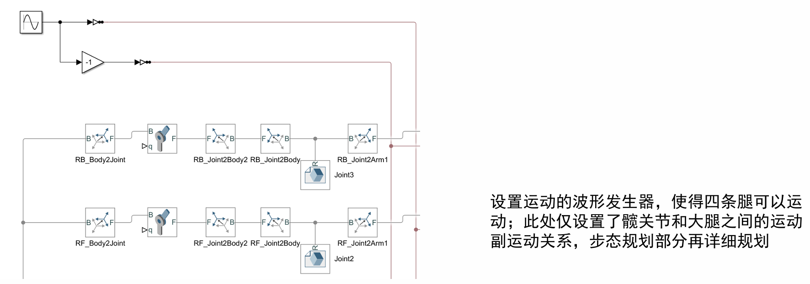

简单的运动仿真

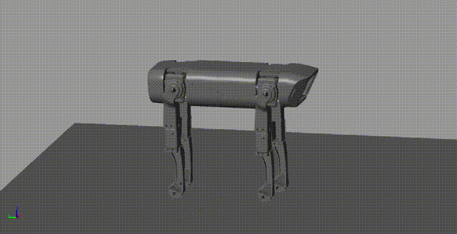

加入了力学反馈

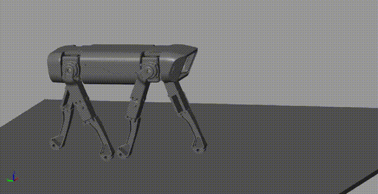

### 装配图

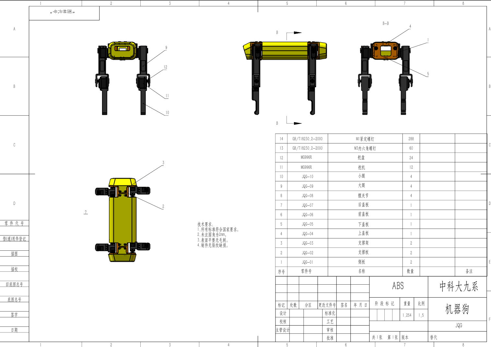

